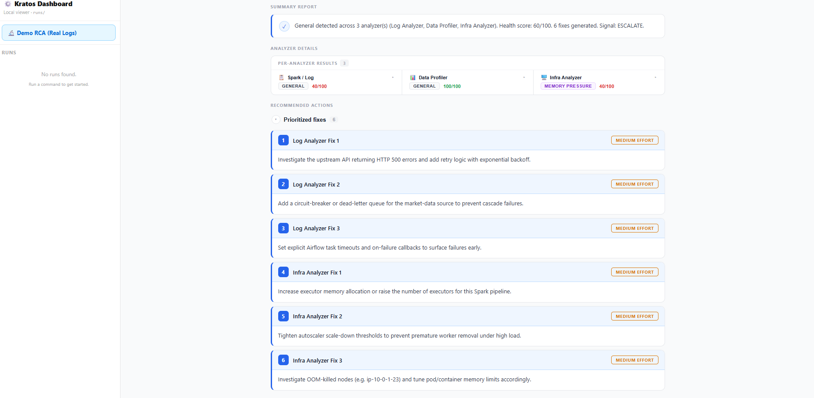

Here’s a cleaned‑up, updated README you can drop in as `README.md` (replace the GitHub URL if needed).

***

# Kratos Agents

## Multi-Agent Root Cause Analysis for Modern Data Platforms

> Intelligent, multi‑agent RCA system for Spark, Airflow, data quality, code changes, and infrastructure — with a production‑ready React dashboard.

***

## 🚀 Overview

Kratos is a **multi‑agent orchestration system** that performs automated root cause analysis (RCA) across distributed data platforms.

It ingests:

- Spark execution logs  
- Airflow task logs  
- Dataset snapshots / data quality fingerprints  
- Git commit history  
- Infrastructure / observability metrics  

It then:

1. Routes inputs to specialized analyzers.  
2. Triangulates cross‑domain signals into a unified view.  
3. Generates structured `IssueProfile` objects.  
4. Produces prioritized `RecommendationReport` objects.  
5. Renders results in a React dashboard for human review.

This is not a single-agent LLM wrapper.
It is a **deterministic orchestration layer coordinating multiple analyzers**.
# Kratos

**Your AI-powered assistant for understanding Spark jobs, data pipelines, and code dataflow — all in plain English.**

[](https://github.com/sumitasthana/kratos-agents/wiki)
[](https://www.python.org/downloads/)

📚 **[Complete Documentation Available in Wiki](https://github.com/sumitasthana/kratos-agents/wiki)** - Installation guides, tutorials, examples, troubleshooting, and more!

---

## What Does This Tool Do?

Kratos is a comprehensive data engineering analysis platform that helps you understand and troubleshoot your data pipelines without needing to be an expert. It provides three main capabilities:

### 1. **Spark Job Analysis** 📊
Analyzes Apache Spark event logs to diagnose performance issues, explain query execution, and identify root causes of failures.

**You provide**: A Spark event log file (automatically generated when Spark jobs run)  
**Kratos creates**: A "fingerprint" — a structured summary of what happened during execution  
**AI agents analyze**: The fingerprint and explain issues in plain English

### 2. **Git Repository Dataflow Analysis** 🔄
Extracts data flow patterns from your git repository's commit history to understand how data moves through your codebase.

**You provide**: A git repository URL or local path  
**Kratos extracts**: Commit diffs and code changes  
**AI agents identify**: Data reads, writes, joins, transformations, and dataflow patterns

### 3. **Data Lineage Extraction** 🔗
Analyzes ETL scripts to extract table and column-level data lineage, helping you understand data dependencies.

**You provide**: Spark ETL scripts (.py, .sql)  
**Kratos extracts**: Table and column dependencies  
**AI agents trace**: Upstream and downstream data flows

### Example Questions It Can Answer:

- *"Why is my Spark job running slow?"* (Spark Analysis)
- *"What is this query actually doing?"* (Spark Analysis)
- *"Why did my job fail?"* (Spark Analysis)
- *"Where is the bottleneck in my data pipeline?"* (Spark Analysis)
- *"What data sources does this code read from?"* (Git Dataflow)
- *"Where does this table come from?"* (Lineage Extraction)
- *"What columns depend on customer_id?"* (Lineage Extraction)

---

## Quick Start (5 Minutes)

### Step 1: Install

```bash
pip install -r requirements.txt
```

### Step 2: Set Up Your API Key

Create a `.env` file with your OpenAI API key:
```
OPENAI_API_KEY=your-api-key-here
```

### Step 3: Choose Your Analysis Type

**Option A: Analyze a Spark Job**
```bash
# Ask a question about your Spark job (generates a fingerprint first)
python -m src.cli orchestrate --from-log your_event_log.json --query "Why is my Spark job slow?"

# Or generate a fingerprint only
python -m src.cli fingerprint your_event_log.json
```

**Option B: Analyze Git Repository Dataflow**
```bash
# Clone a repository and analyze dataflow patterns
python -m src.cli git-clone https://github.com/your-org/your-repo.git --dest your-repo
python -m src.cli git-log ./runs/cloned_repos/your-repo
python -m src.cli git-dataflow --latest --dir ./runs/git_artifacts --llm
```

**Option C: Extract Data Lineage from ETL Scripts**
```bash
# Extract lineage from your ETL scripts
python -m src.cli lineage-extract --folder ./path/to/etl/scripts
```
# Kratos Agents — Spark Execution Analyzer

> Intelligent multi-agent system for automated Spark job analysis, root cause identification, and actionable performance recommendations.

---

## What It Does

Kratos ingests Spark execution logs, generates an **ExecutionFingerprint**, and routes it through a two-layer agent orchestration pipeline. The result is a structured RCA report surfaced in a React dashboard — with health scoring, severity-ranked findings, and green fix blocks attached directly to each issue.

***

## 🧠 What Kratos Analyzes

| Domain | Input               | Agent(s)                                   | Output                               |
|--------|---------------------|--------------------------------------------|--------------------------------------|
| Spark  | Event logs          | RootCauseAgent + QueryUnderstandingAgent  | `ExecutionFingerprint` + RCA         |
| Airflow| Task logs           | AirflowLogAnalyzerAgent                    | Task health & workload summary       |
| Data   | Dataset snapshot / DQ logs | DataProfilerAgent (stub today)      | Null spikes, schema drift (planned)  |
| Code   | Git history         | ChangeAnalyzerAgent                        | Churn risk, contributor silo         |
| Infra  | Cluster metrics     | InfraAnalyzerAgent                         | Resource pressure / memory pressure  |

Each agent emits an `AgentResponse`, which the orchestrators convert into an `AnalysisResult` for triangulation.

***

## 🏗 Architecture

```text
KratosOrchestrator
    │
    ▼
RoutingAgent
    │
    ├── SparkOrchestrator
    ├── AirflowLogAnalyzerOrchestrator
    ├── CodeAnalyzerOrchestrator
    ├── DataProfilerOrchestrator
    ├── ChangeAnalyzerOrchestrator
    └── InfraAnalyzerOrchestrator
           │
           ▼
    TriangulationAgent
           │
           ▼
    RecommendationAgent
           │
           ▼
    RecommendationReport
           │
           ▼
    React Dashboard (Demo RCA / RCA Findings)
```

Each analyzer produces an `AnalysisResult`.

The **TriangulationAgent** merges results into a unified `IssueProfile` with:

- `dominant_problem_type`  
- `overall_health_score`  
- `overall_confidence`  
- Per‑domain analyses: `log_analysis`, `code_analysis`, `data_analysis`, `change_analysis`, `infra_analysis`  
- `correlations` (cross‑agent patterns)  
- `agents_invoked`, `total_findings_count`, `critical_findings_count`

The **RecommendationAgent** turns the `IssueProfile` into a `RecommendationReport` with:

- `executive_summary` (health, analyzers, fixes, signal)  
- `prioritized_fixes` (Fix objects with effort/priority)  
- `ontology_update` (learned patterns / control refs)  
- `feedback_loop_signal` (`ESCALATE`, `RERUN`, `RESOLVED`, `MONITOR`)

***

## 📊 Dashboard

The Vite + React dashboard provides:

- **Demo RCA – Real Fixture Logs** page  
  - Select Spark / Airflow / Data / Infra / Change signals.  
  - Run RCA via `POST /api/run_rca_from_logs`.  
  - Visualize overall health, per‑analyzer cards, and prioritized fixes.  
- **Run viewer** (optional)  
  - Historical runs sidebar (if wired to a runs backend).  
- Visuals:
  - Overall health score and dominant problem type.  
  - Analyzer status strip (Spark / Airflow / Data / Infra / Change).  
  - Expandable findings per analyzer.  
  - Cross‑agent correlations.  
  - Executive summary and confidence.  
  - Prioritized fixes with effort/priority badges.

The backend is UI‑agnostic; the dashboard consumes pure JSON (`RecommendationReport`).

***

## 🏷 Problem Types

Kratos uses standardized problem types across agents:

| Type               | Description                                      |
|--------------------|--------------------------------------------------|
| HEALTHY            | No anomalies detected                            |
| EXECUTION_FAILURE  | Spark task failures dominate                     |
| MEMORY_PRESSURE    | Spill / OOM / high memory usage                  |
| SHUFFLE_OVERHEAD   | Excessive shuffle traffic                        |
| DATA_SKEW          | Skew penalties dominate                          |
| NULL_SPIKE         | Data profiler detects null ratio spike           |
| SCHEMA_DRIFT       | Column or type drift                             |
| CHURN_SPIKE        | Large change window in Git history               |
| CONTRIBUTOR_SILO   | Single‑author dominance on critical paths        |
| REGRESSION_RISK    | Risky change preceding failure                   |
| CORRELATED_FAILURE | Multi‑agent pattern detected                     |
| GENERAL            | No single dominant issue                         |

Infra‑specific conditions (e.g., resource pressure) are expressed via `infra_analysis.problem_type` plus correlations.

***

## 📐 Confidence Scoring (Spark Path)

Confidence for Spark RCA is derived from four components:

| Signal             | Max Points |
|--------------------|-----------:|
| Data completeness  | 30         |
| Signal dominance   | 30         |
| Agent agreement    | 20         |
| Cause clarity      | 20         |

- Confidence is normalized to \[0.0, 1.0\], with a floor at **0.40**.  
- No hardcoded confidence constants; it is computed from the fingerprint and agent responses.

***

## 🔗 Cross‑Agent Correlation

The triangulation layer detects patterns such as:

- Churn spike + Spark execution failure.  
- Compliance gap + null spike in the same dataset.  
- Infra memory pressure + Spark execution failure / memory pressure.  
- Schema drift + downstream ETL regression.

These become `CrossAgentCorrelation` objects with:

- Pattern description.  
- Severity.  
- Contributing agents.  
- Confidence.  
- Optional affected artifacts.

These correlations also feed into the recommendation layer to create cross‑domain fixes.

***

## 📂 Project Structure

```text
kratos-agents/
├── src/
│   ├── orchestrator.py          # KratosOrchestrator, SparkOrchestrator, routing, triangulation, recommendation
│   ├── schemas.py               # Pydantic models (fingerprints, IssueProfile, RecommendationReport…)
│   ├── agent_coordination.py    # AgentContext, SharedFinding
│   ├── agents/
│   │   ├── base.py              # BaseAgent, AgentType
│   │   ├── root_cause.py        # Spark RCA
│   │   ├── query_understanding.py
│   │   ├── airflow_log_analyzer.py
│   │   ├── data_profiler_agent.py   # Stub for now
│   │   ├── change_analyzer_agent.py
│   │   └── infra_analyzer_agent.py
│   ├── cli.py                   # CLI entry points
│   ├── context_generator.py     # Builds LLM context from fingerprints
│   └── semantic_generator.py    # DAG semantic layer
│
├── dashboard/
│   ├── src/
│   │   ├── App.tsx              # App shell / routing
│   │   ├── RCAFindings.tsx      # Main RCA findings view
│   │   └── DemoRCA.tsx          # Demo RCA – Real Fixture Logs
│   ├── server.js                # Static server + local proxy
│   ├── vite.config.ts           # Dev proxy to FastAPI
│   └── package.json
│
├── logs/                        # Raw + processed logs (gitignored)
├── tests/                       # Smoke + API tests
├── screenshots/                 # Dashboard screenshots
├── requirements.txt
└── README.md
```

***

## ⚙ Setup

### Backend

```bash
git clone https://github.com/sumitasthana/kratos-agents.git
cd kratos-agents

python -m venv venv
# Mac/Linux
source venv/bin/activate
# Windows
venv\Scripts\activate

pip install -r requirements.txt
```

Start the RCA API (from the `src/` directory if that’s where `rca_api.py` lives):

```bash
cd src
uvicorn rca_api:app --reload   # http://127.0.0.1:8000
```

### Dashboard

```bash
cd dashboard
npm install

npm run dev      # http://127.0.0.1:5173 (via Vite proxy to FastAPI)
# or production build:
npm run build
npm start        # e.g. http://localhost:4173
```

The dashboard proxies `/api/*` requests to the FastAPI backend.

***

## ▶ Running Kratos

## Spark
## Requirements

- Python 3.10+
- OpenAI API key (for AI analysis)
- Spark event log files (JSON format from Spark History Server)
- Node.js 16+ and npm (for the optional dashboard UI)

---

## Documentation

### 📚 Comprehensive Wiki
Visit our **[GitHub Wiki](https://github.com/sumitasthana/kratos-agents/wiki)** for complete documentation:

- **[Home](https://github.com/sumitasthana/kratos-agents/wiki/Home)** - Overview and navigation
- **[Installation Guide](https://github.com/sumitasthana/kratos-agents/wiki/Installation-Guide)** - Platform-specific installation
- **[Quick Start Tutorial](https://github.com/sumitasthana/kratos-agents/wiki/Quick-Start-Tutorial)** - Step-by-step getting started
- **[Spark Job Analysis](https://github.com/sumitasthana/kratos-agents/wiki/Spark-Job-Analysis)** - Performance troubleshooting guide
- **[Troubleshooting](https://github.com/sumitasthana/kratos-agents/wiki/Troubleshooting)** - Common issues and solutions
- **[FAQ](https://github.com/sumitasthana/kratos-agents/wiki/FAQ)** - Frequently asked questions (40+)
- **[Examples](https://github.com/sumitasthana/kratos-agents/wiki/Examples)** - Real-world use cases

### 📖 Additional Documentation
- [QUICKSTART.md](QUICKSTART.md) - Detailed installation and usage guide
- [ARCHITECTURE.md](ARCHITECTURE.md) - Technical deep dive
- [API_REFERENCE.md](API_REFERENCE.md) - Complete API documentation
- [WIKI_DEPLOYMENT.md](WIKI_DEPLOYMENT.md) - Instructions for deploying the wiki

---

## FAQ

**Q: Do I need to be a Spark expert to use this?**  
A: No! The tool explains everything in plain English.

**Q: What can Kratos analyze?**  
A: Kratos can analyze three types of data engineering artifacts:
1. **Spark event logs** - for performance troubleshooting and query understanding
2. **Git repositories** - for extracting dataflow patterns from code changes
3. **ETL scripts** - for extracting table and column-level data lineage

**Q: Where do I get Spark event log files?**  
A: Spark automatically generates them. Check your Spark History Server or the `spark.eventLog.dir` configuration.

**Q: Does it work with Databricks/EMR/Dataproc?**  
A: Yes, as long as you can export the event log JSON files.

**Q: How much does it cost?**  
A: The tool is free. You only pay for OpenAI API usage (typically a few cents per analysis).

**Q: Can I visualize the results?**  
A: Yes! Use the **Dashboard** web UI to interactively explore results with graphs, lineage diagrams, and formatted findings. See the Dashboard section above for setup instructions.

**Q: What's the difference between git-dataflow and lineage-extract?**  
A: 
- **git-dataflow**: Analyzes git commit history to extract dataflow patterns from code changes (great for understanding how data flows evolved)
- **lineage-extract**: Analyzes current ETL scripts to extract detailed table/column lineage (great for data governance and compliance)
## Running

```bash
python -m src.cli orchestrate \
  --log-path logs/raw/spark_events/log.json
```

With a natural‑language question:

```bash
python -m src.cli orchestrate \
  --log-path logs/raw/spark_events/log.json \
  --query "Why is my job slow?"
```

### Demo RCA – Real Fixture Logs (UI)

1. Start FastAPI (`uvicorn rca_api:app --reload`).  
2. Start the dashboard (`npm run dev`).  
3. Open the **Demo RCA – Real Fixture Logs** page.  
4. Select which signals to include (Spark / Airflow / Data / Infra / Change).  
5. Enter a question and click **Run RCA**.  
6. Inspect:
   - Overall health & dominant problem type.  
   - Per‑analyzer cards.  
   - Cross‑agent correlations.  
   - Prioritized fixes from the RecommendationAgent.

### Programmatic – Python

```python
from src.orchestrator import KratosOrchestrator

kratos = KratosOrchestrator()
report = await kratos.run(
    user_query="Nightly OHLCV pipeline is failing and cluster looks hot.",
    execution_fingerprint=spark_fp,
    airflow_fingerprint=airflow_fp,
    infra_fingerprint=infra_fp,
    dataset_path="path/to/dq_fingerprint.json",
    git_log_path="path/to/git_log.json",
)

print(report.executive_summary)
for fix in report.prioritized_fixes:
    print(f"- [{fix.priority}] {fix.title}: {fix.description}")
```

***

## 🧩 Design Principles

- Deterministic orchestration over opaque single‑LLM reasoning.  
- Clear separation of **analysis** (Python agents) and **presentation** (React).  
- Negation‑aware severity and recommendation extraction.  
- Two‑phase classification: routing decision vs. health‑derived override.  
- Explicit contracts via Pydantic schemas.  
- Pluggable multi‑agent architecture (Spark, Airflow, Data, Code, Infra).

***

## 🛠 Contributing

```bash
git checkout -b arunesh/<feature-name>

# Make focused changes with good tests.
git commit -m "feat(orchestrator): <short description>"
git push origin arunesh/<feature-name>
```

Then open a pull request describing:

- Motivation / context.  
- Changes to orchestrator or agents.  
- Any new tests or demo scenarios.

***

## 👥 Authors

- **@sumitasthana** — Project lead, initial architecture.  
- **@AruneshDev** — Orchestration engine, multi‑agent RCA, dashboard & demo flow.