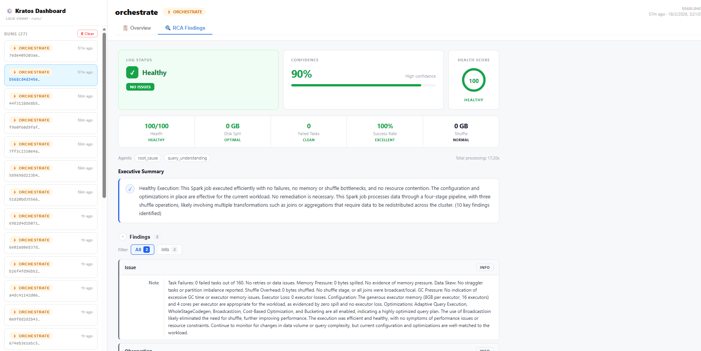
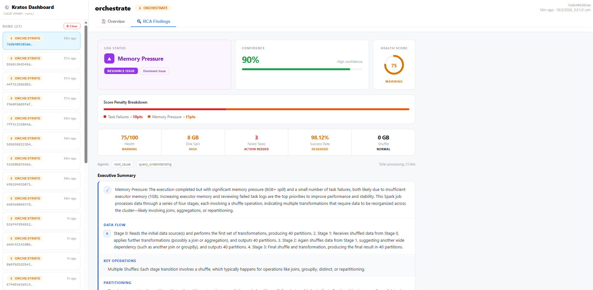
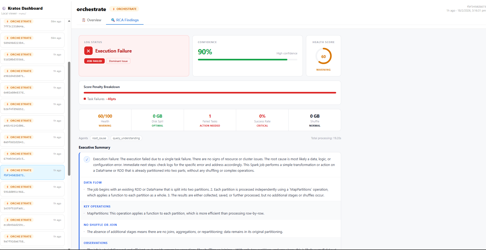

# Kratos

**Your AI-powered assistant for understanding Spark jobs, data pipelines, and code dataflow — all in plain English.**

[](https://github.com/sumitasthana/kratos-agents/wiki)
[](https://www.python.org/downloads/)

📚 **[Complete Documentation Available in Wiki](https://github.com/sumitasthana/kratos-agents/wiki)** - Installation guides, tutorials, examples, troubleshooting, and more!

---

## What Does This Tool Do?

Kratos is a comprehensive data engineering analysis platform that helps you understand and troubleshoot your data pipelines without needing to be an expert. It provides three main capabilities:

### 1. **Spark Job Analysis** 📊
Analyzes Apache Spark event logs to diagnose performance issues, explain query execution, and identify root causes of failures.

**You provide**: A Spark event log file (automatically generated when Spark jobs run)  
**Kratos creates**: A "fingerprint" — a structured summary of what happened during execution  
**AI agents analyze**: The fingerprint and explain issues in plain English

### 2. **Git Repository Dataflow Analysis** 🔄
Extracts data flow patterns from your git repository's commit history to understand how data moves through your codebase.

**You provide**: A git repository URL or local path  
**Kratos extracts**: Commit diffs and code changes  
**AI agents identify**: Data reads, writes, joins, transformations, and dataflow patterns

### 3. **Data Lineage Extraction** 🔗
Analyzes ETL scripts to extract table and column-level data lineage, helping you understand data dependencies.

**You provide**: Spark ETL scripts (.py, .sql)  
**Kratos extracts**: Table and column dependencies  
**AI agents trace**: Upstream and downstream data flows

### Example Questions It Can Answer:

- *"Why is my Spark job running slow?"* (Spark Analysis)
- *"What is this query actually doing?"* (Spark Analysis)
- *"Why did my job fail?"* (Spark Analysis)
- *"Where is the bottleneck in my data pipeline?"* (Spark Analysis)
- *"What data sources does this code read from?"* (Git Dataflow)
- *"Where does this table come from?"* (Lineage Extraction)
- *"What columns depend on customer_id?"* (Lineage Extraction)

---

## Quick Start (5 Minutes)

### Step 1: Install

```bash
pip install -r requirements.txt
```

### Step 2: Set Up Your API Key

Create a `.env` file with your OpenAI API key:
```
OPENAI_API_KEY=your-api-key-here
```

### Step 3: Choose Your Analysis Type

**Option A: Analyze a Spark Job**
```bash
# Ask a question about your Spark job (generates a fingerprint first)
python -m src.cli orchestrate --from-log your_event_log.json --query "Why is my Spark job slow?"

# Or generate a fingerprint only
python -m src.cli fingerprint your_event_log.json
```

**Option B: Analyze Git Repository Dataflow**
```bash
# Clone a repository and analyze dataflow patterns
python -m src.cli git-clone https://github.com/your-org/your-repo.git --dest your-repo
python -m src.cli git-log ./runs/cloned_repos/your-repo
python -m src.cli git-dataflow --latest --dir ./runs/git_artifacts --llm
```

**Option C: Extract Data Lineage from ETL Scripts**
```bash
# Extract lineage from your ETL scripts
python -m src.cli lineage-extract --folder ./path/to/etl/scripts
```
# Kratos Agents — Spark Execution Analyzer

> Intelligent multi-agent system for automated Spark job analysis, root cause identification, and actionable performance recommendations.

---

## What It Does

Kratos ingests Spark execution logs, generates an **ExecutionFingerprint**, and routes it through a two-layer agent orchestration pipeline. The result is a structured RCA report surfaced in a React dashboard — with health scoring, severity-ranked findings, and green fix blocks attached directly to each issue.

---

## Dashboard Preview

### Healthy Execution

Zero failures, zero spill, health score 100/100. Confidence score driven by data completeness and signal strength — not hardcoded.

### Memory Pressure

8 GB disk spill, 3 failed tasks. Score penalty breakdown shows Task Failures −10pts + Memory Pressure −15pts. Executive Summary parsed into Data Flow, Key Operations, and Partitioning sections.

### Execution Failure

Single task failure with 0% success rate. Task Failures −40pts penalty dominates. No shuffle or memory involvement — classified as `EXECUTION_FAILURE` by the health-score derivation layer.

---

## Architecture

```

Spark Event Log
│
▼
ExecutionFingerprint
├── metrics.execution_summary  (tasks, spill, shuffle, duration)
├── metrics.anomalies
├── semantic.dag               (stages, operations)
└── context.spark_config
│
▼
SmartOrchestrator
├── _classify_problem_from_query()   → initial ProblemType (keyword heuristic)
├── _analyze_fingerprint_characteristics() → hints dict
├── _plan_agent_execution()          → ordered List[AgentTask]
│
├── RootCauseAgent          → health score, penalty breakdown, key findings
├── QueryUnderstandingAgent → DAG explanation, data flow, key operations
│
├── _derive_problem_type_from_health()  → final ProblemType (overrides initial)
├── _compute_confidence()               → real signal-based score (not hardcoded)
└── _synthesize_results()              → AnalysisResult
│
▼
RCAFindings.tsx  (React dashboard)
├── LogStatusCard      — problem type + category badge
├── ConfidenceCard     — computed confidence %
├── HealthGaugeCard    — SVG ring gauge
├── ScoreBreakdownBar  — penalty stacked bar
├── KPIStrip           — health / spill / failures / success rate / shuffle / duration
├── ExecutiveSummary   — parsed intro + named sections (Data Flow, Key Operations…)
├── FindingCard        — severity badge + labeled rows + green FIX block
└── Recommendations    — numbered actionable list

```

---

## Problem Types

| Type | Trigger | Color |
|---|---|---|
| `HEALTHY` | No penalties, all tasks succeeded | Green |
| `EXECUTION_FAILURE` | Task failure penalty dominates (≥ 40%) | Red |
| `MEMORY_PRESSURE` | Memory/spill penalty dominates | Purple |
| `SHUFFLE_OVERHEAD` | Shuffle penalty dominates | Blue |
| `DATA_SKEW` | Skew penalty dominates | Yellow |
| `PERFORMANCE` | Multiple equal causes, no single dominant | Amber |
| `LINEAGE` | Query/DAG explanation requested | Teal |
| `GENERAL` | No clear classification | Grey |

---

## Confidence Scoring

Replaced the hardcoded `0.90` agent value with a four-signal computed score:

| Signal | Max Points | What it measures |
|---|---|---|
| Data completeness | 30 | Tasks, stages, duration, spill, shuffle, anomalies present |
| Signal strength | 30 | Dominance ratio of the top penalty (decisive vs ambiguous) |
| Agent agreement | 20 | How many agents ran and succeeded |
| Cause clarity | 20 | Does numeric evidence match the classified problem type |
| **Floor** | — | Minimum 0.40 for any completed analysis |

---

## Finding Cards

Each finding has three visual layers:

```

┌─ Task Failures                               [HIGH] ──┐
│  Symptom   │ 3 out of 160 tasks failed               │
│  Root Cause│ Likely OOM / insufficient executor mem  │
│  Impact    │ Retries triggered, increased duration   │
├────────────────────────────────────────────────────── ┤
│  FIX  Review Spark logs for OOM. Increase executor   │
│       memory or optimize memory usage.               │
└────────────────────────────────────────────────────── ┘

```

- Severity inferred from **title + description only** — never from the fix text
- Generic titles (`Issue`, `Analysis`, `Note`) are **downgraded** from CRITICAL → HIGH unless true crash/OOM language is present
- `Recommended Fix` rows are routed to `finding.recommendation`, rendered in green — never part of findings count or severity

---

## Project Structure

```

kratos-agents/
├── src/
│   ├── orchestrator.py          # SmartOrchestrator + all helpers
│   ├── schemas.py               # Pydantic models (ExecutionFingerprint, AnalysisResult…)
│   ├── agent_coordination.py    # AgentContext, SharedFinding
│   ├── agents/
│   │   ├── base.py              # BaseAgent, AgentType enum
│   │   └── root_cause.py        # RootCauseAgent
│   ├── cli.py                   # CLI entry point
│   ├── context_generator.py     # Fingerprint context builder
│   └── semantic_generator.py    # DAG semantic layer
│
├── dashboard/
│   ├── src/
│   │   ├── App.tsx              # Main app shell, run sidebar
│   │   └── RCAFindings.tsx      # Full RCA findings UI component
│   └── package.json
│
├── scripts/
│   └── multi/
│       ├── collect_test_logs.py
│       ├── generate_spark_event_logs.py
│       └── setup_log_storage.py
│
├── logs/                        # Runtime log storage (gitignored)
├── requirements.txt
└── README.md

````

---

## Setup

### Backend

```bash
git clone https://github.com/sumitasthana/kratos-agents.git
cd kratos-agents

python -m venv venv311
source venv311/bin/activate        # Mac/Linux
venv311\Scripts\activate           # Windows PowerShell

pip install -r requirements.txt
````

### Dashboard

```bash
cd dashboard
npm install
npm run dev        # development — http://localhost:5173
npm run build      # production build → dist/
```

---

## Requirements

- Python 3.10+
- OpenAI API key (for AI analysis)
- Spark event log files (JSON format from Spark History Server)
- Node.js 16+ and npm (for the optional dashboard UI)

---

## Documentation

### 📚 Comprehensive Wiki
Visit our **[GitHub Wiki](https://github.com/sumitasthana/kratos-agents/wiki)** for complete documentation:

- **[Home](https://github.com/sumitasthana/kratos-agents/wiki/Home)** - Overview and navigation
- **[Installation Guide](https://github.com/sumitasthana/kratos-agents/wiki/Installation-Guide)** - Platform-specific installation
- **[Quick Start Tutorial](https://github.com/sumitasthana/kratos-agents/wiki/Quick-Start-Tutorial)** - Step-by-step getting started
- **[Spark Job Analysis](https://github.com/sumitasthana/kratos-agents/wiki/Spark-Job-Analysis)** - Performance troubleshooting guide
- **[Troubleshooting](https://github.com/sumitasthana/kratos-agents/wiki/Troubleshooting)** - Common issues and solutions
- **[FAQ](https://github.com/sumitasthana/kratos-agents/wiki/FAQ)** - Frequently asked questions (40+)
- **[Examples](https://github.com/sumitasthana/kratos-agents/wiki/Examples)** - Real-world use cases

### 📖 Additional Documentation
- [QUICKSTART.md](QUICKSTART.md) - Detailed installation and usage guide
- [ARCHITECTURE.md](ARCHITECTURE.md) - Technical deep dive
- [API_REFERENCE.md](API_REFERENCE.md) - Complete API documentation
- [WIKI_DEPLOYMENT.md](WIKI_DEPLOYMENT.md) - Instructions for deploying the wiki

---

## FAQ

**Q: Do I need to be a Spark expert to use this?**  
A: No! The tool explains everything in plain English.

**Q: What can Kratos analyze?**  
A: Kratos can analyze three types of data engineering artifacts:
1. **Spark event logs** - for performance troubleshooting and query understanding
2. **Git repositories** - for extracting dataflow patterns from code changes
3. **ETL scripts** - for extracting table and column-level data lineage

**Q: Where do I get Spark event log files?**  
A: Spark automatically generates them. Check your Spark History Server or the `spark.eventLog.dir` configuration.

**Q: Does it work with Databricks/EMR/Dataproc?**  
A: Yes, as long as you can export the event log JSON files.

**Q: How much does it cost?**  
A: The tool is free. You only pay for OpenAI API usage (typically a few cents per analysis).

**Q: Can I visualize the results?**  
A: Yes! Use the **Dashboard** web UI to interactively explore results with graphs, lineage diagrams, and formatted findings. See the Dashboard section above for setup instructions.

**Q: What's the difference between git-dataflow and lineage-extract?**  
A: 
- **git-dataflow**: Analyzes git commit history to extract dataflow patterns from code changes (great for understanding how data flows evolved)
- **lineage-extract**: Analyzes current ETL scripts to extract detailed table/column lineage (great for data governance and compliance)
## Running

```bash
# Analyse a Spark event log
python -m src.cli orchestrate --log-path logs/raw/spark_events/your_log.json

# Run with custom query
python -m src.cli orchestrate \
  --log-path logs/raw/spark_events/your_log.json \
  --query "Why is my job slow?"

# Point dashboard at your runs folder
# Edit dashboard/src/App.tsx → LOCAL_RUNS_PATH
```

---

## Key Design Decisions

* **Two-phase problem classification** — keyword heuristic for initial routing, health-score metadata for final override after RCA completes
* **Shape A + Shape B finding grouper** — handles both explicit section headers and repeated `Symptom:` runs from LLM output
* **Negation-aware severity** — `_NEGATION_PATTERNS` checked before keyword banks to prevent `"0 failed tasks"` → CRITICAL
* **No emoji in backend** — prefix labels like `"Memory Pressure: "` are plain text; icons assigned by the frontend `getLogStatusMeta()`

---

## Contributing

```bash
git checkout -b arunesh/<feature-name>

git commit -m "feat(scope): short description

- bullet point for each logical change"

git push -u origin arunesh/<feature-name>
# Open PR into main on GitHub
```

---

## Authors

* **sumitasthana** — project lead / repo owner
* **AruneshDev** — orchestrator engine, RCA UI, confidence scoring
