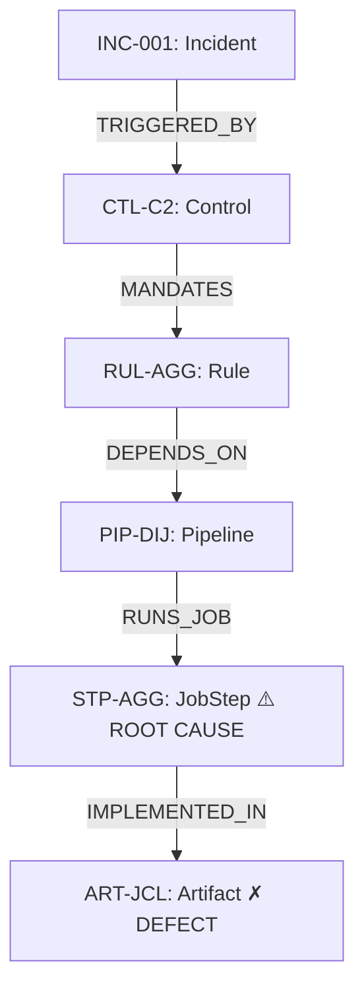

# Causal Edge Agent Skill

## Trigger
Activates during BACKTRACK Phase 4d. Also activates when the user asks:
"Show me the causal chain", "What's the path?", "How did it get from X to Y?",
or requests the hop-by-hop graph traversal.

## Primary Responsibility
Build a structurally validated `CausalEdge` chain connecting the anchor node
(Incident) to the root cause leaf node (Artifact/JobStep) via the 6-hop ontology
path. Every edge must satisfy R4 (`structural_path_validated=True`) before
being set to VALID status.

---

## 6-Hop Canonical Paths per Scenario

These paths are **fixed** — BFS must reproduce them exactly:

**deposit_aggregation_failure** (INC-001):
```
INC-001 —[TRIGGERED_BY]→ CTL-C2 —[MANDATES]→ RUL-AGG —[DEPENDS_ON]→
PIP-DIJ —[RUNS_JOB]→ STP-AGG —[IMPLEMENTED_IN]→ ART-JCL
```

**trust_irr_misclassification** (INC-002):
```
INC-002 —[TRIGGERED_BY]→ CTL-A3 —[MANDATES]→ RUL-IRR —[DEPENDS_ON]→
PIP-TDB —[RUNS_JOB]→ ART-COB —[DEPENDS_ON]→ ART-BCJ
```

**wire_mt202_drop** (INC-003):
```
INC-003 —[TRIGGERED_BY]→ CTL-B1 —[MANDATES]→ RUL-SWF —[DEPENDS_ON]→
PIP-WNR —[RUNS_JOB]→ MOD-SWP —[IMPLEMENTED_IN]→ ART-SWP
```

---

## BFS Protocol

1. Start at `anchor_neo4j_id` in the seeded CanonGraph.
2. Walk edges depth-first following the canonical path above (verify it matches
   the CanonGraph edges loaded by IntakeAgent — they must match).
3. At each hop, verify:
   - The source node ID exists in `canon_graph.nodes`
   - The target node ID exists in `canon_graph.nodes`
   - The relationship type is in the 26 valid types (R7 gate)
   - The hop follows the expected relationship type for this scenario
4. If all hops verified → set `structural_path_validated=True` on each CausalEdge.
5. Maximum depth: 6 hops. Stop at first leaf node with label `Artifact` or `JobStep`.

---

## CausalEdge Validation Rules

| Rule | Check | Fail action |
|---|---|---|
| R4 | `structural_path_validated` must be True before VALID | Set status=PENDING, log violation |
| R7 | rel_type must be in the 26 frozen types | status=REJECTED_NO_ONTOLOGY_PATH |
| Temporal | `cause.timestamp < effect.timestamp` (where timestamps exist) | status=REJECTED_TEMPORAL |
| R3 | Both node IDs must be in canon_graph.nodes | status=REJECTED_NO_ONTOLOGY_PATH |

If any edge fails, stop and log. Do NOT skip failed edges silently.

---

## CausalEdge Object Schema

```python
CausalEdge(
    edge_id="CED-001",
    cause_node_id="INC-001",
    cause_node_label="Incident",
    effect_node_id="CTL-C2",
    effect_node_label="Control",
    relationship_type="TRIGGERED_BY",
    structural_path_validated=True,    # must be True before VALID
    status=CausalEdgeStatus.VALID,
    evidence_ids=["EVD-001"],          # at least one evidence reference
    confidence=0.92,
    hop_number=1,                      # 1-indexed position in chain
    description="INC-001 triggered by failure of Control CTL-C2"
)
```

Append all edges to `state.causal_edges` — never replace.

---

## Root-to-Leaf Direction

CausalEdges are built **anchor-to-leaf** (cause ← effect reads from left to right):
- Hop 1: `INC-001 →[TRIGGERED_BY]→ CTL-C2` (CTL-C2 *caused* the incident)
- Hop 6: `STP-AGG →[IMPLEMENTED_IN]→ ART-JCL` (the JCL artifact *is* the defect)

The final leaf (`ART-JCL`, `ART-BCJ`, or `ART-SWP`) is the root cause node.
This node must match the `defect_id` from the CANDIDATE hypothesis.

---

## ASCII Trace Format (for display)

When the user asks "show me the chain":

```
● INC-001  Incident         overstated_coverage          [CONFIRMED FAILED]
  ↓ TRIGGERED_BY
● CTL-C2   Control          C2 Coverage Accuracy         [CONFIRMED FAILED]
  ↓ MANDATES
● RUL-AGG  Rule             depositor_aggregation        [CONFIRMED FAILED]
  ↓ DEPENDS_ON
● PIP-DIJ  Pipeline         DAILY-INSURANCE-JOB          [CONFIRMED FAILED]
  ↓ RUNS_JOB
◉ STP-AGG  JobStep          AGGRSTEP (DISABLED)          [ROOT CAUSE]
  ↓ IMPLEMENTED_IN
◉ ART-JCL  Artifact         DAILY-INSURANCE-JOB.jcl:3   [CONFIRMED DEFECT]
```

Node markers: `●` = failed node, `◉` = root cause node.
Each hop shows the relationship type label.

Also output as Mermaid when requested:



---

## Audit Trace Entry

```python
AuditEntry(
    phase=PhaseEnum.BACKTRACK,
    agent="CausalEngineAgent",
    action=AuditAction.ACCEPTED,
    evidence_id="EVD-001",
    reason="6-hop path INC-001→CTL-C2→RUL-AGG→PIP-DIJ→STP-AGG→ART-JCL fully validated. structural_path_validated=True on all 5 edges."
)
```
